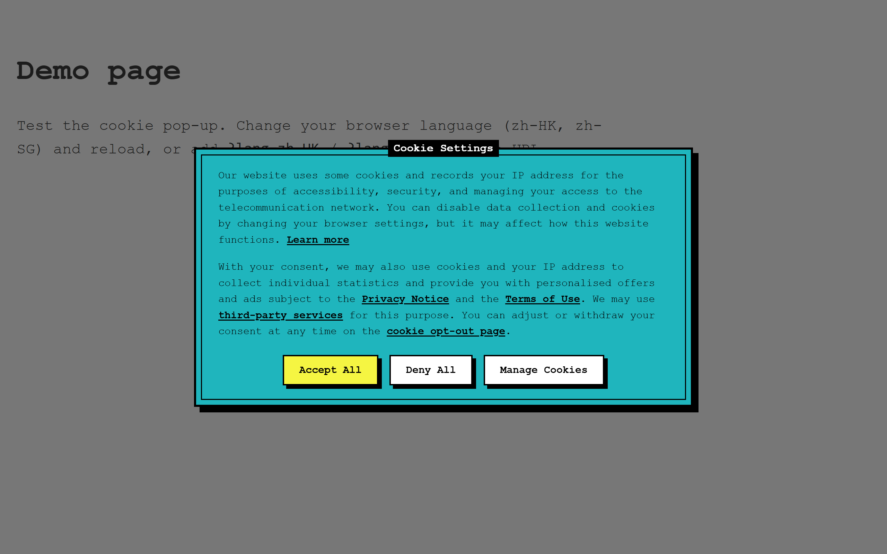
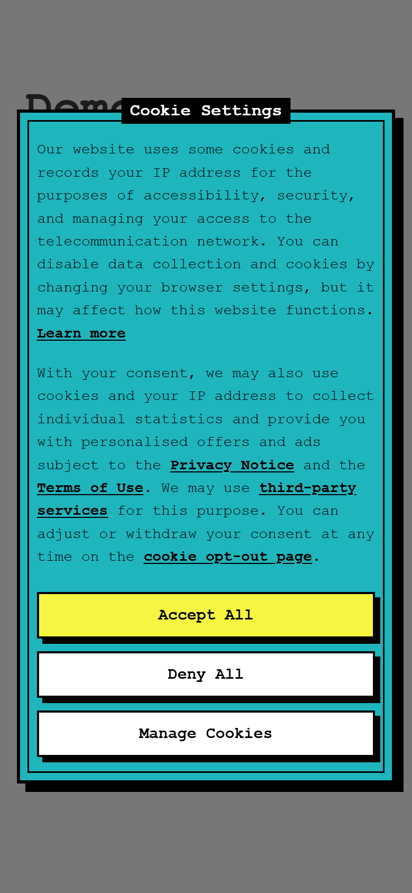
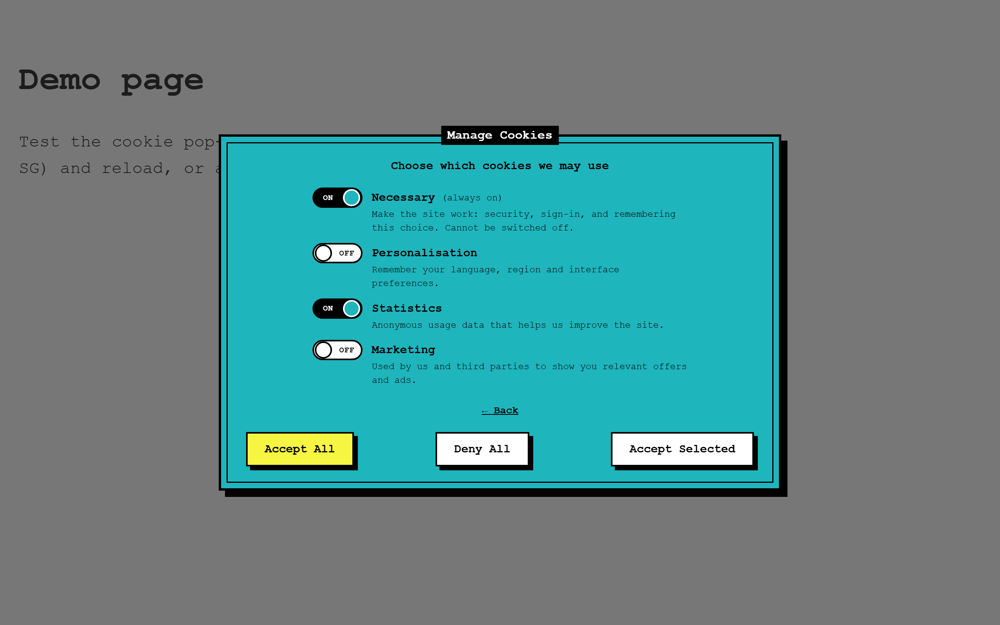
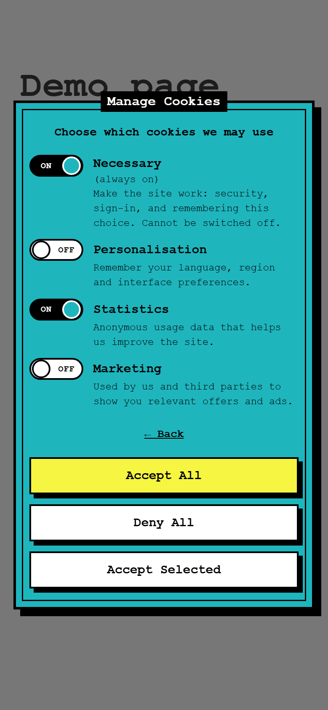
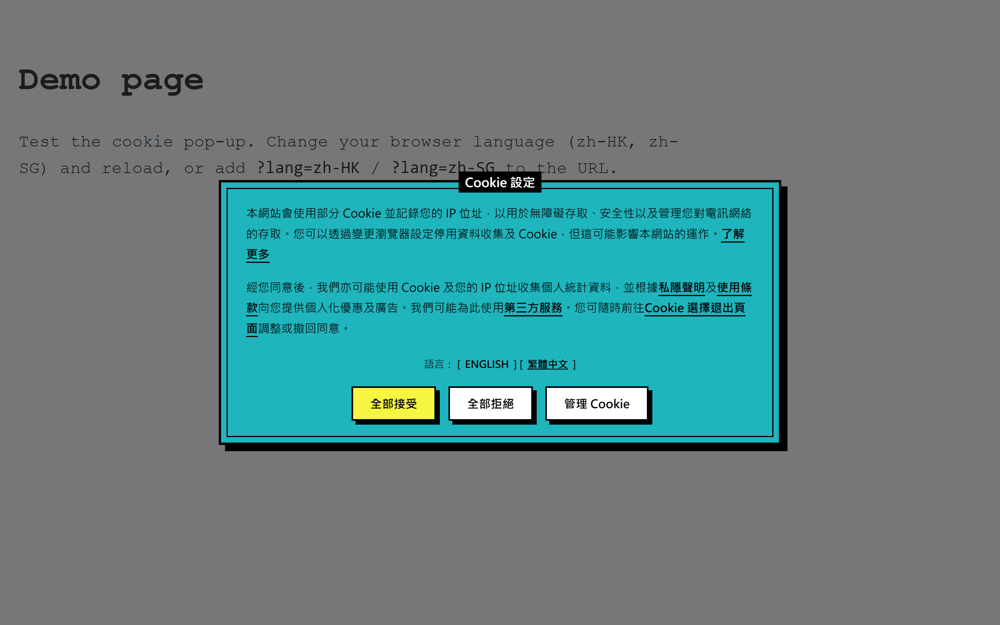
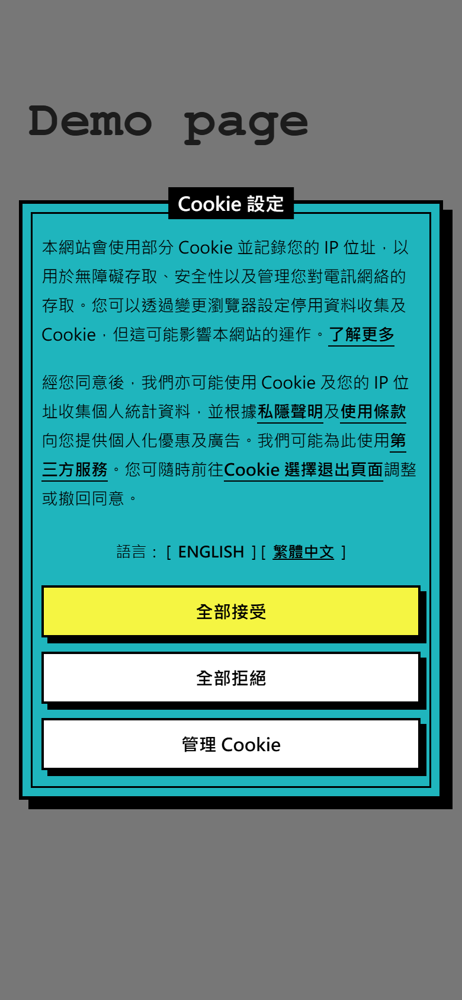
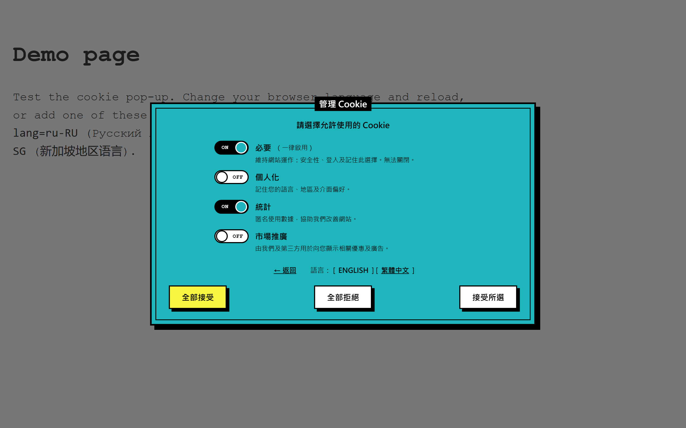
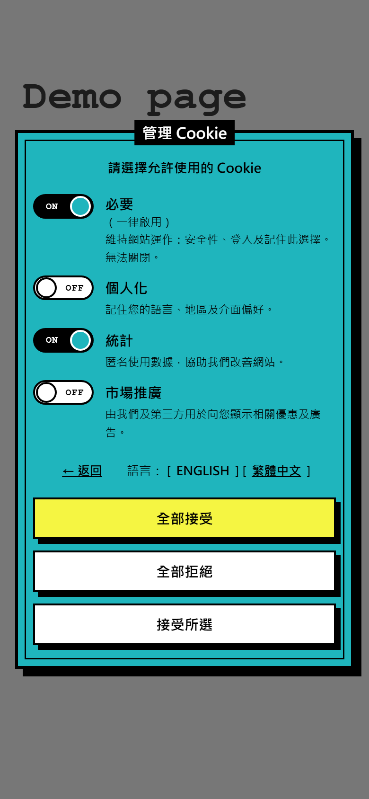

# retro-cookie-banner

<p>
  <a href="LICENSE" target="_blank" rel="noopener"></a>
  <a href="https://github.com/AbbeyLubber/retro-cookie-banner/commits/main" target="_blank" rel="noopener"></a>
  <a href="https://abbeylubber.github.io/retro-cookie-banner/" target="_blank" rel="noopener"></a>
  <a href="https://abbeylubber.github.io/retro-cookie-banner/" target="_blank" rel="noopener"></a>
  <a href="https://github.com/AbbeyLubber/retro-cookie-banner/" target="_blank" rel="noopener"></a>
  <a href="https://github.com/AbbeyLubber/retro-cookie-banner/" target="_blank" rel="noopener"></a>
</p>

**retro-cookie-banner** is a free, open-source cookie consent banner (cookie popup / GDPR cookie notice) written in plain HTML, CSS and vanilla JavaScript. It ships as a single self-contained HTML file with zero dependencies — no framework, no build step, no external requests — and drops into any website, static site or CMS.

The banner detects the visitor's browser language and shows itself in one of nine languages (English, German, Russian, Ukrainian, Belarusian, Finnish, Estonian, Traditional Chinese for Hong Kong, Simplified Chinese for Singapore). Visitors can accept all cookies, deny all, or pick categories (necessary, personalisation, statistics, marketing) on a settings screen with toggle switches. The choice is stored as JSON in `localStorage`, the banner appears only once, and the whole dialog is keyboard-accessible with a focus trap, visible focus rings and `prefers-reduced-motion` support. The look is retro/brutalist: hard shadows, thick black borders, monospace type.

Call it what you like — cookie banner, cookie popup, cookie notice, cookie bar, consent dialog, GDPR / ePrivacy consent modal — it is the same thing: a small, self-hosted alternative to cookie-consent SaaS scripts and to heavier JavaScript libraries.

**The banner is one file: [`banner/index.html`](banner/index.html).** Everything else in the repository is documentation, screenshots and the GitHub Pages demo around it.

## Live demo

The banner picks the language from the browser. Click a parameter to open the demo in that language:

| Flag | Parameter | Language |
|:---:|:---:|:---:|
| :gb: | [`?lang=en-GB`](https://abbeylubber.github.io/retro-cookie-banner/?lang=en-GB) | English (English) — default |
| :hong_kong: | [`?lang=zh-HK`](https://abbeylubber.github.io/retro-cookie-banner/?lang=zh-HK) | 繁體中文（香港）(Traditional Chinese, Hong Kong) |
| :singapore: | [`?lang=zh-SG`](https://abbeylubber.github.io/retro-cookie-banner/?lang=zh-SG) | 简体中文（新加坡）(Simplified Chinese, Singapore) |
| :ru: | [`?lang=ru-RU`](https://abbeylubber.github.io/retro-cookie-banner/?lang=ru-RU) | Русский (Russian) |
| :ukraine: | [`?lang=uk-UA`](https://abbeylubber.github.io/retro-cookie-banner/?lang=uk-UA) | Українська (Ukrainian) |
| :finland: | [`?lang=fi-FI`](https://abbeylubber.github.io/retro-cookie-banner/?lang=fi-FI) | Suomi (Finnish) |
| :de: | [`?lang=de-DE`](https://abbeylubber.github.io/retro-cookie-banner/?lang=de-DE) | Deutsch (German) |
| :belarus: | [`?lang=be-BY`](https://abbeylubber.github.io/retro-cookie-banner/?lang=be-BY) | Беларуская (Belarusian) |
| :estonia: | [`?lang=et-EE`](https://abbeylubber.github.io/retro-cookie-banner/?lang=et-EE) | Eesti (Estonian) |

## Language detection

`navigator.languages` is checked in order; the first entry that matches wins, everything else falls back to English.

| Browser locale | Banner language |
|:---:|:---:|
| `en`, `en-GB`, `en-US`, `en-*` | English (British spelling) |
| `zh-HK`, `zh-MO`, `zh-TW`, `zh-Hant`, `zh-Hant-*` | Traditional Chinese (Hong Kong) |
| `zh-SG`, `zh-CN`, `zh`, `zh-Hans`, `zh-Hans-*` | Simplified Chinese (Singapore) |
| `ru`, `ru-*` | Russian |
| `uk`, `uk-*` | Ukrainian |
| `fi`, `fi-*` | Finnish |
| `de`, `de-*` | German |
| `be`, `be-*` | Belarusian |
| `et`, `et-*` | Estonian |
| anything else | English |

The `lang` attribute is set on the dialog only (`en-GB`, `zh-HK`, `zh-SG`, `ru`, `uk`, `fi`, `de`, `be`, `et`), so the host page's own language is untouched.

## Features

- **One HTML file.** No build step, no framework, no external requests. Copy and paste.
- **Nine languages, picked automatically** from `navigator.languages`: British English, German, Russian, Ukrainian, Belarusian, Finnish, Estonian, Traditional Chinese (Hong Kong) and Simplified Chinese (Singapore). Anything else falls back to English.
- **In-banner language switch** — `Language: [ENGLISH] [繁體中文]` — shown only when the browser language is not English. Positions are fixed; the active language is lowercase and underlined, the other one is uppercase and clickable.
- **Two screens:** a short notice with *Accept All / Deny All / Manage Cookies*, and a settings screen with *Necessary* (locked), *Personalisation*, *Statistics* and *Marketing* toggles, each with a one-line description and an ON/OFF label inside the switch.
- **Shown once.** The decision is saved as JSON in `localStorage.cookieConsent`; on the next visit the banner is never rendered.
- **Keyboard first.** *Accept All* is the default button and receives focus; `Enter` anywhere inside the dialog triggers it unless the focus is on another button, link or toggle. `Tab` is trapped inside the dialog until a choice is made.
- **Accessible.** `role="dialog"`, `aria-modal`, `role="switch"` on toggles, visible `:focus-visible` rings, `prefers-reduced-motion` respected, state readable without colour (black border + ON/OFF text).
- **Responsive** from 320 px (iPhone 5) to TV screens: buttons stack on phones, the whole dialog scales up on ≥1600 px displays.

## Screenshots

### English (browser language is English)

No language switch is shown — the visitor sees only the banner.

| Desktop | Mobile (390 px) |
|:---:|:---:|
|  |  |
|  |  |

### Local language (browser language is not English)

The banner opens in the visitor's language and adds a `Language: [ENGLISH] [native]` switch above the buttons. Traditional Chinese (Hong Kong) shown as an example.

| Desktop | Mobile (390 px) |
|:---:|:---:|
|  |  |
|  |  |

## Usage

`banner/index.html` is the banner plus a small demo page around it. To add the banner to your own site, copy three blocks from it:

1. The `<style>` block from `<head>` (everything under `.cookie-overlay` / `.cookie*`; the `.page` rule is demo-only).
2. The `<div class="cookie-overlay" id="cookieOverlay" hidden>…</div>` markup — put it right before `</body>`.
3. The `<script>` block that follows it.

That's it. The banner shows itself on the first visit and stays hidden afterwards.

### Reading the consent

```js
var consent = JSON.parse(localStorage.getItem('cookieConsent') || 'null');
// → { necessary: true, personalization: false, statistics: true, marketing: false }
if (consent && consent.statistics) {
  // load your analytics
}
```

`Accept All` stores every category as `true`, `Deny All` stores everything except `necessary` as `false`, `Accept Selected` stores the toggle states.

### Customising

- **Texts** live in the `T` dictionary at the top of the script, one object per language. Every key maps to an element with the matching `data-t` (plain text) or `data-t-html` (paragraphs with links) attribute.
- **Links** in the two paragraphs are `href="#"` placeholders — point them at your privacy notice, terms and opt-out page.
- **Colours** are CSS custom properties on `:root`: `--bg` (teal), `--ink` (black), `--paper` (white), `--accent` (yellow primary button).
- **Storage key** is `STORAGE_KEY` at the top of the script.

### Adding a language

Two edits, both inside the `<script>` block. Example for Polish:

```js
// 1. Add a dictionary entry. Copy the `en` object and translate every value.
pl: {
  langName: 'Polski', langLabel: 'Język:',
  title: 'Ustawienia cookie', settingsTitle: 'Zarządzaj cookie',
  p1: '…', p2: '…',
  accept: 'Zaakceptuj wszystkie', deny: 'Odrzuć wszystkie', manage: 'Zarządzaj cookie', save: 'Zaakceptuj wybrane',
  settingsIntro: 'Wybierz, których cookie możemy używać', back: '← Wstecz', alwaysOn: '(zawsze włączone)',
  necessary: 'Niezbędne', necessaryDesc: '…',
  personalization: 'Personalizacja', personalizationDesc: '…',
  statistics: 'Statystyka', statisticsDesc: '…',
  marketing: 'Marketing', marketingDesc: '…'
},

// 2. Teach detectLang() the locale codes.
if (l === 'pl' || l.indexOf('pl-') === 0) return 'pl';
```

`langName` is what appears in the switcher; keep it in the language itself (`Polski`, not `Polish`). Non-Latin scripts that need a different font can be targeted with `.cookie:lang(xx)` in CSS, as the Chinese entries are.

### Testing

Force a language with the `?lang=` parameter — see the [Live demo](#live-demo) table for the values. To see the banner again after making a choice, run `localStorage.removeItem('cookieConsent')` in the console and reload.

## Comparison with other cookie consent tools

| | retro-cookie-banner | [cookieconsent](https://github.com/orestbida/cookieconsent) | [Klaro!](https://github.com/klaro-org/klaro-js) | [tarteaucitron.js](https://github.com/AmauriC/tarteaucitron.js) | Cookiebot, CookieYes, OneTrust (SaaS) |
|:---:|:---:|:---:|:---:|:---:|:---:|
| Delivery | one HTML file | JS + CSS files | JS + CSS files | JS + CSS + language files | script loaded from the vendor |
| Dependencies | none | none | none | none | vendor service |
| External requests at runtime | none | none | none | none | yes, every page view |
| Languages built in | 9, auto-detected | you supply translations in config | you supply translations in config | many bundled language files | vendor-managed |
| Category toggles | yes | yes | yes | per-service | yes |
| Consent storage | `localStorage` JSON | cookie / localStorage | cookie / localStorage | cookie | vendor cookie |
| Configuration | edit one dictionary | JS config object | JS config object | JS config + service list | web dashboard |
| Licence | MIT | MIT | BSD-3-Clause | MIT | commercial, free tier with limits |
| Best for | small sites that want one file and no build | sites that need a flexible config API | sites with many third-party services to gate | French-market sites with many services | organisations that need audit logs and consent records |

retro-cookie-banner does one thing: show a consent dialog, remember the answer. It does not block third-party scripts for you — read the consent object and load your analytics or ads only when the matching category is `true`.

## FAQ

**Is this GDPR compliant?**
It implements the mechanics the GDPR and the ePrivacy Directive ask for: no non-essential cookies before consent, an equally prominent *Deny All*, granular categories and a way to change the choice later. Compliance also depends on your texts, your privacy notice and on actually gating your scripts behind the consent object — the banner cannot do that part for you.

**Does it work without a framework?**
Yes. It is plain HTML, CSS and ES5-compatible JavaScript. It works on static sites, WordPress, Shopify themes, Jekyll, Hugo, Astro — anything that lets you paste HTML.

**How big is it?**
About 35 KB unminified with all nine languages, in a single file, no external requests.

**How do I read the visitor's choice?**
`JSON.parse(localStorage.getItem('cookieConsent'))` returns `{ necessary, personalization, statistics, marketing }` with boolean values, or `null` if no choice has been made yet.

**How do I show the banner again?**
Remove the key: `localStorage.removeItem('cookieConsent')` and reload. To let visitors reopen it, put that in a "Cookie settings" link in your footer.

**Can I add a language?**
Yes — add one object to the `T` dictionary and one line to `detectLang()`. See [Adding a language](#adding-a-language).

**Can I change the colours or the font?**
Colours are four CSS variables on `:root`; the font stack is `--font`. Nothing else needs to change.

**Does it work on old browsers?**
Everything except the `zoom` rule for very large screens works in any evergreen browser and in Safari from version 12. The script is ES5, so it does not need transpiling.

**Why localStorage and not a cookie?**
A consent cookie would itself have to be declared, and `localStorage` is simpler to read from your own scripts. If you need the value server-side, mirror it into a cookie in the *Reading the consent* snippet.

## Contributing

Translations are the most useful contribution. See [CONTRIBUTING.md](.github/CONTRIBUTING.md); security issues go through [SECURITY.md](.github/SECURITY.md). Release history is in [CHANGELOG.md](CHANGELOG.md).

## Encoding

`banner/index.html` is UTF-8 and starts with a UTF-8 byte-order mark. The BOM takes precedence over the server's `Content-Type` charset, so the nine languages render correctly even on hosts that send `charset=windows-1251` or `iso-8859-1` by mistake.

If you copy the three blocks into your own page instead of using the file as is, that page must be served as UTF-8 (`<meta charset="UTF-8">` first in `<head>` and no conflicting HTTP header) — otherwise the non-Latin strings in the `T` dictionary will be garbled.

## Browser support

Any evergreen browser. The only newer CSS feature is `zoom` on very large screens (Chrome, Safari, Firefox 126+); older browsers simply show the dialog at its normal 720 px width.

## License

[MIT](LICENSE)
